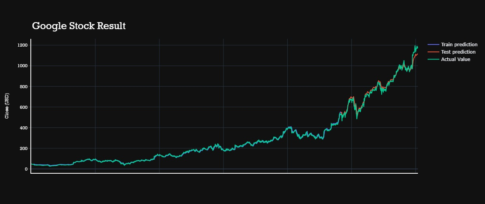
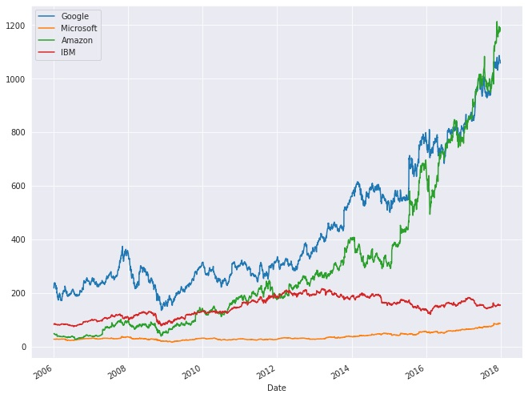
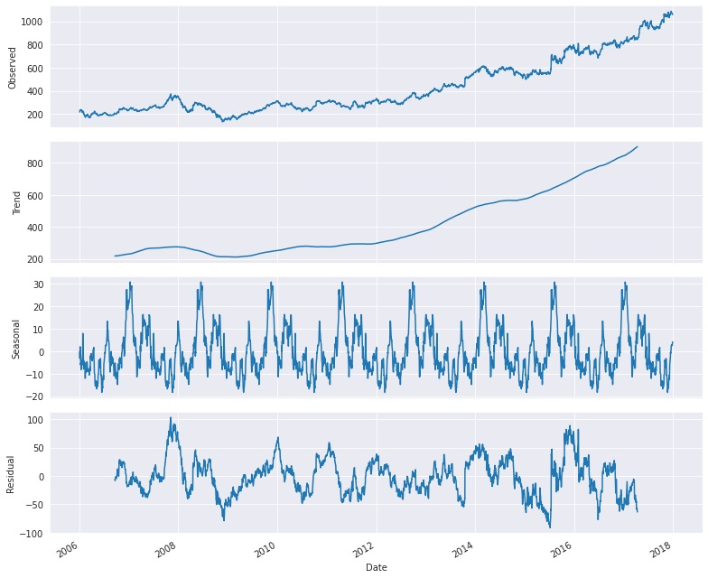
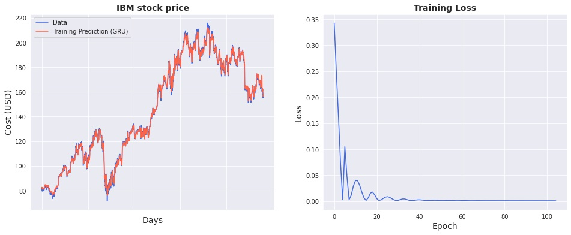
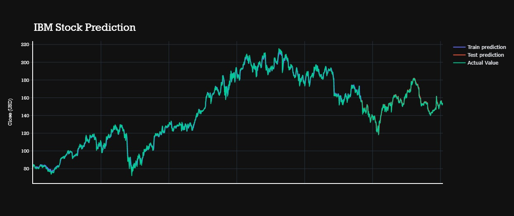

# Stock-Market-Analysis-And-Forecasting-Using-Deep-Learning

This a project of Stock Market Analysis And Forecasting Using Deep Learning(pytorch,gru).

A stock market, equity market, or share market is the aggregation of buyers and sellers of stocks (also called shares), which represent ownership claims on businesses; these may include securities listed on a public stock exchange, as well as stock that is only traded privately, such as shares of private companies which are sold to investors through equity crowdfunding platforms. Investment in the stock market is most often done via stockbrokerages and electronic trading platforms. Investment is usually made with an investment strategy in mind.

The task of stock prediction has always been a challenging problem for statistics experts and nance. The main reason behind this prediction is buying stocks that are likely to increase in price and then selling stocks that are probably to fall. Generally, there are two ways for stock market prediction. Fundamental analysis is one of them and relies on a company's technique and fundamental information like market position, expenses and annual growth rates. The second one is the technical analysis method, which concentrates on previous stock prices and values.

In the first part of our project, we will try to analyze the data. and in the second part, we will forecast the stock market.

DATASET
------
Google | Microsoft | IBM | Amazon

Analysis
------

As we can see here Microsoft's "High" value is very slowly increasing straight line. IBM's "High" value and Amazon's "High" value started from the approx same stage, even Amazon's "High" value was a bit lower but after 2012 Amazon's "High" value started to exponentially increase and slight drop for IBM's "High" value. Since 2016 there is a high fight going between Google's "High" value and Amazon's "High" value at 2018 Amazon's "High" value also beat Google's "High" value.

In Microsoft data, we can see in 2009 "High" value was under mean for a long time, so we can say there was some loss.

In Google data,there is a very slow increasing trend until 2012, but after 2012 there was an exponential high trend. And very high seasonality.

Forecasting 
------
**Time series forecasting** uses information regarding historical values and associated patterns to predict future activity. Most often, this relates to trend analysis, cyclical fluctuation analysis, and issues of seasonality. As with all forecasting methods, success is not guaranteed.

**GRU Model:**

Gated recurrent unit is essentially a simplified LSTM. It has the exact same role in the network. The main difference is in the number of gates and weights — GRU is somewhat simpler. It has 2 gates. Since it does not have an output gate, there is no control over the memory content. The update gate controls the information flow from the previous activation, and the addition of new information as well, while the reset gate is inserted into the candidate activation.

    
  

Results
-----

Blog:
----

Check out my Medium article ,where I have explained in detail.

[Blog Link](https://nandisoham2017.medium.com/stock-market-analysis-and-forecasting-using-deep-learning-f75052e81301)

Web Application Demo:
-----

https://www.linkedin.com/posts/soham-nandi-b39288215_datascience-deeplearning-stockmarket-activity-6817124891163197440-nMmj

THANK YOU :sparkling_heart:
-----
